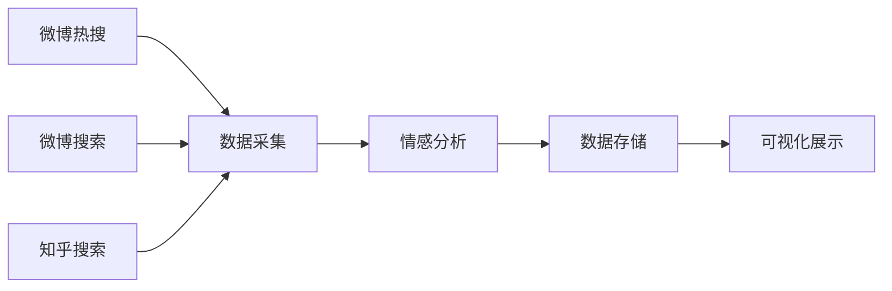

# 中文社交媒体舆情分析系统

基于深度学习的中文情感分析和舆情监测系统，支持微博、知乎的数据采集与实时分析。

## 项目简介

本项目是一个完整的 NLP 应用系统，集数据采集、预处理、模型训练和可视化展示于一体。通过对微博热搜、知乎讨论等中文社交媒体内容的实时抓取和分析，实现公众意见和情感的自动识别。

## 功能特性

- **三平台数据采集**：支持微博热搜、微博搜索、知乎搜索
- **双模型架构**：LSTM（轻量级）和 BERT（高精度）
- **自动化流程**：一键采集 → 分析 → 输出 JSON
- **可视化输出**：生成供 GitHub Pages 展示的数据格式
- **模块化设计**：爬虫、数据处理、模型、训练各模块独立

## 项目结构

```
nlp-public-opinion-analysis/
├── data/                              # 数据集目录
│   ├── weibo_senti_100k.csv             # 10万条微博情感数据 (19MB)
│   └── simplifyweibo_4_moods.csv        # 4类情绪分类数据 (71MB)
├── html/                              # GitHub Pages 输出目录
│   └── data/
│       └── analysis.json              # 生成的分析数据
├── notebooks/                         # Jupyter notebooks (实验/旧版代码)
│   ├── model_bert.ipynb               # BERT 模型实验
│   ├── topic_detect_model.ipynb       # 主题检测实验
│   ├── weibo_crawler.ipynb            # 微博爬虫实验
│   ├── zhihu_crawler.ipynb            # 知乎爬虫实验
│   ├── weibo_data.jsonl               # 爬虫输出数据
│   └── zhihu_answers.jsonl            # 爬虫输出数据
├── src/                               # 主要源代码
│   ├── models/                          # 模型定义 & 预训练权重
│   │   ├── bert.py                      # BERT 分类模型
│   │   ├── lstm.py                      # LSTM 分类模型
│   │   ├── lstm_sentiment_small.pth     # LSTM 训练权重 (12MB)
│   │   ├── chinese-roberta-wwm-ext/     # 中文 RoBERTa 预训练模型
│   │   └── text2vec-base-chinese/       # 句向量预训练模型
│   ├── data_crawler.py                  # 数据爬虫 (三平台)
│   ├── dataset.py                       # 数据集处理
│   ├── tokenizer.py                     # 分词器 & 相似度可视化
│   ├── train.py                         # 训练 & 评估
│   └── script.py                        # 主入口脚本
├── .env                                 # 环境变量配置 (需自行创建)
├── .gitignore                           # Git 忽略文件
├── environment.yml                      # Conda 环境配置
├── requirements.txt                     # Python 依赖
├── LICENSE                              # MIT License
└── README.md                            # 本文档
```

## 快速开始

### 环境要求

- Python >= 3.8
- PyTorch >= 2.0
- CUDA（可选，用于 GPU 加速）

### 安装依赖

**方式 1: 使用 Conda (推荐)**

```bash
# 创建新环境并安装依赖
conda env create -f environment.yml

# 激活环境
conda activate nlp-poa

# 如果环境已存在，更新它
conda env update -f environment.yml --prune
```

**方式 2: 使用 pip**

```bash
# 安装依赖
pip install -r requirements.txt
```

### 配置

创建 `.env` 文件并配置以下环境变量：

```bash
# 微博爬虫配置（如果报错 432 需要更新）
WEIBO_HEADERS={"User-Agent": "Mozilla/5.0...", "Referer": "https://m.weibo.cn/"}
WEIBO_COOKIES=你的微博Cookie
WEIBO_X_XSRF_TOKEN=你的XSRF令牌

# 模型路径
SENTENCE_MODEL_PATH=./src/models/text2vec-base-chinese
BERT_PATH=./src/models/chinese-roberta-wwm-ext
LSTM_MODEL_SAVE_PATH=./src/models/lstm_sentiment_small.pth
DATA_PATH=./data
```

## 使用方法

### 1. 数据采集（一键运行）

```bash
python src/script.py
```

**执行流程：**
1. 抓取微博热搜（50+ 条）
2. 用热搜关键词搜索微博内容
3. 用热搜关键词搜索知乎讨论
4. 对所有内容进行情感分析
5. 保存到 `html/data/analysis.json`

### 2. 数据爬虫（单独使用）

```python
from src.data_crawler import WeiboHotCrawler, WeiboTextCrawler, ZhihuSearchCrawler

# 微博热搜（不需要登录）
hot_crawler = WeiboHotCrawler()
hot_results = hot_crawler.crawl()

# 微博搜索（需要配置 Cookie）
text_crawler = WeiboTextCrawler()
results = text_crawler.crawl('关键词', max_pages=10)

# 知乎搜索（需要 DrissionPage，会打开浏览器）
zhihu_crawler = ZhihuSearchCrawler()
results = zhihu_crawler.crawl('关键词', max_results=20)
```

### 3. 模型训练

```bash
python src/train.py
```

### 4. 相似度可视化

```bash
python src/tokenizer.py
```

## 输出数据格式

`html/data/analysis.json` 结构示例：

```json
{
  "metadata": {
    "timestamp": "2026-02-11 17:16:00",
    "weibo_hot_count": 52,
    "weibo_posts_count": 124,
    "zhihu_count": 45
  },
  "weibo_hot": [
    {"rank": 1, "word": "热搜话题", "label_name": "热"}
  ],
  "weibo_posts": [
    {
      "source": "weibo",
      "text": "微博内容...",
      "likes": 100,
      "comments": 50,
      "reposts": 10,
      "sentiment": "positive",
      "sentiment_score": 0.85
    }
  ],
  "zhihu": [
    {
      "source": "zhihu",
      "keyword": "搜索词",
      "title": "回答标题",
      "content": "内容摘要...",
      "author": "作者名",
      "likes": 1000,
      "sentiment": "neutral",
      "sentiment_score": 0.5
    }
  ],
  "sentiment_summary": {
    "positive": 73,
    "negative": 1,
    "neutral": 118
  }
}
```

## 模型说明

### LSTM 模型
- **架构**: 双向 LSTM
- **词嵌入维度**: 128
- **隐藏层维度**: 64
- **适用场景**: 资源受限场景，推理速度快
- **文件**: `src/models/lstm.py`, `src/models/lstm_sentiment_small.pth`

### BERT 模型
- **预训练模型**: `hfl/chinese-roberta-wwm-ext`
- **最大序列长度**: 128
- **适用场景**: 高精度要求
- **文件**: `src/models/bert.py`

### Sentence Embedding
- **模型**: `shibing624/text2vec-base-chinese`
- **用途**: 文本相似度计算、语义检索
- **文件**: `src/tokenizer.py`

## 数据集

| 数据集 | 描述 | 大小 | 来源 |
|--------|------|------|------|
| weibo_senti_100k.csv | 10万条微博情感数据 (正面/负面) | 19MB | [ChineseNlpCorpus](https://github.com/SophonPlus/ChineseNlpCorpus) |
| simplifyweibo_4_moods.csv | 4类情绪分类数据 (喜/怒/哀/乐) | 71MB | [ChineseNlpCorpus](https://github.com/SophonPlus/ChineseNlpCorpus) |

## 技术栈

- **深度学习**: PyTorch
- **NLP**: HuggingFace Transformers, sentence-transformers
- **爬虫**: requests, DrissionPage, fake-useragent
- **数据处理**: pandas, numpy, scikit-learn
- **可视化**: matplotlib, seaborn

## 开发路线图



## License

MIT License
